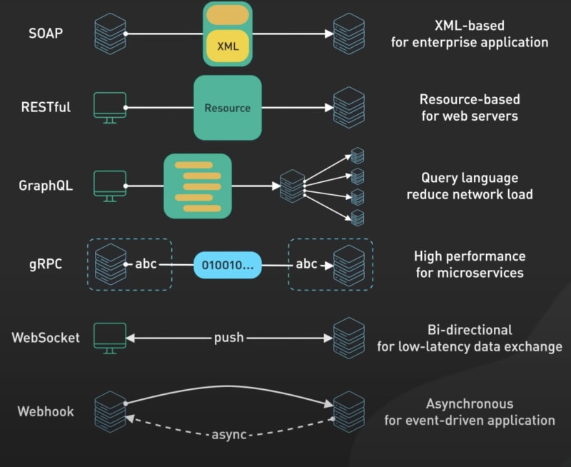

We'll use Flask, a lightweight web framework in Python, to create our webhook receiver.

### Requirements


**Flask:** You can install Flask using pip:
```bash
pip install Flask
```

### Example Code

Here's a basic Flask application that acts as a webhook receiver:

```python
from flask import Flask, request
import json

app = Flask(__name__)

@app.route('/webhook', methods=['POST'])
def webhook():
    if request.method == 'POST':
        # Parse the JSON payload
        payload = json.loads(request.data)
        
        # Assume the payload contains issue details under 'issue' key
        issue_title = payload.get('issue', {}).get('title', 'No title')
        issue_body = payload.get('issue', {}).get('body', 'No body')

        print(f"New Issue Created: {issue_title}")
        print(f"Description: {issue_body}")

        return "Webhook received!", 200

if __name__ == '__main__':
    app.run(debug=True, port=5000)
```

### How It Works

1. **Webhook Endpoint:** The Flask app defines a `/webhook` endpoint that listens for POST requests.
2. **Payload Processing:** When a POST request is received, the app assumes it's a JSON payload from GitHub containing information about a newly created issue. It then extracts the issue title and body from this payload.
3. **Response:** The app prints the details of the issue and responds to the webhook sender with a confirmation message.

### Testing the Webhook Locally

1. **Run the Flask App:** Execute the script to start the Flask server.
2. **Use a Service like Ngrok:** Since GitHub cannot send webhook notifications to your localhost directly, you can use a service like Ngrok to expose your local server to the internet.
3. **Configure the Webhook on GitHub:** Go to your GitHub repository settings, find the Webhooks section, and add your Ngrok URL (e.g., `https://<your-ngrok-id>.ngrok.io/webhook`).
4. **Create an Issue in GitHub:** After setting up the webhook, create an issue in your repository. GitHub will send a notification to your webhook URL.
5. **Check Your Console:** You should see the issue details printed out in your console where the Flask app is running.




Ref: [1](https://www.youtube.com/watch?v=4vLxWqE94l4)
